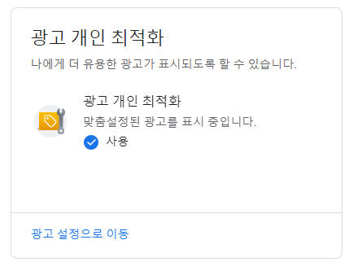
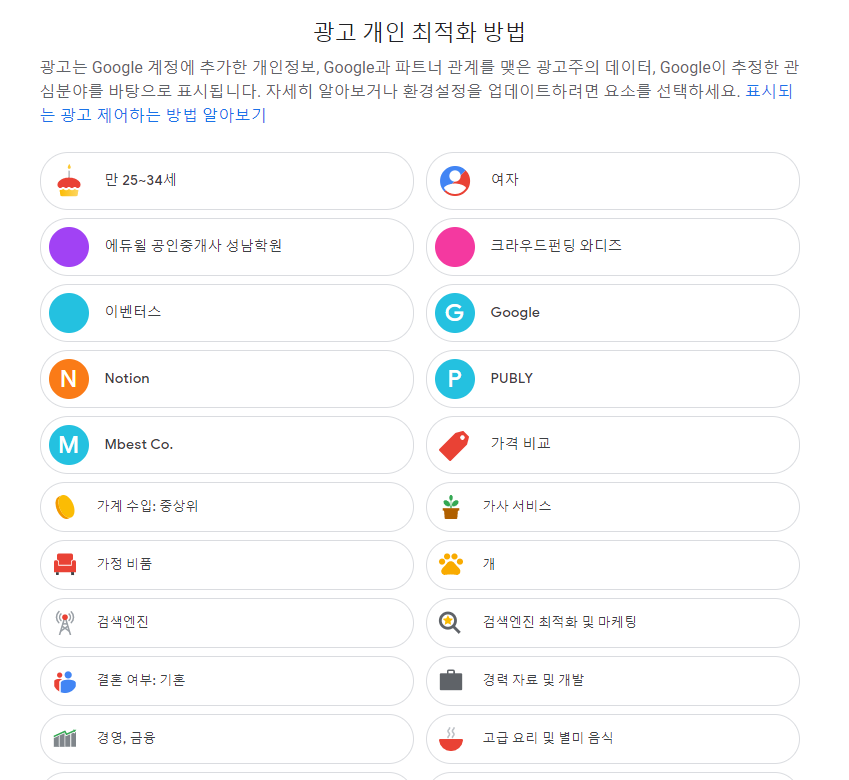
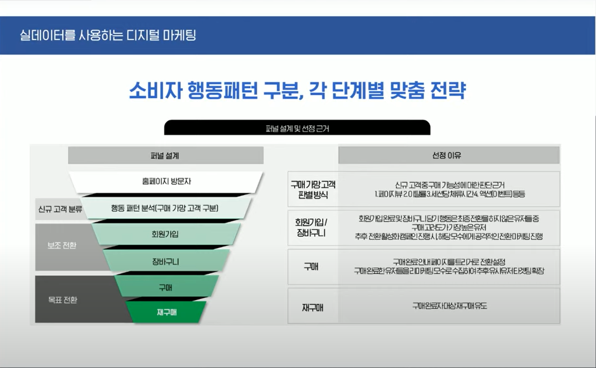
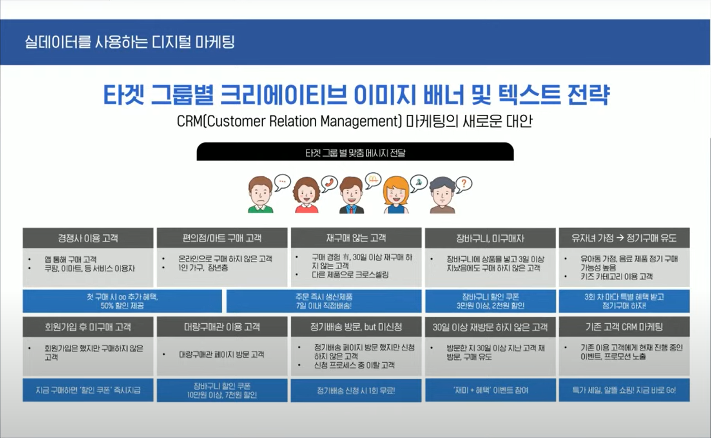
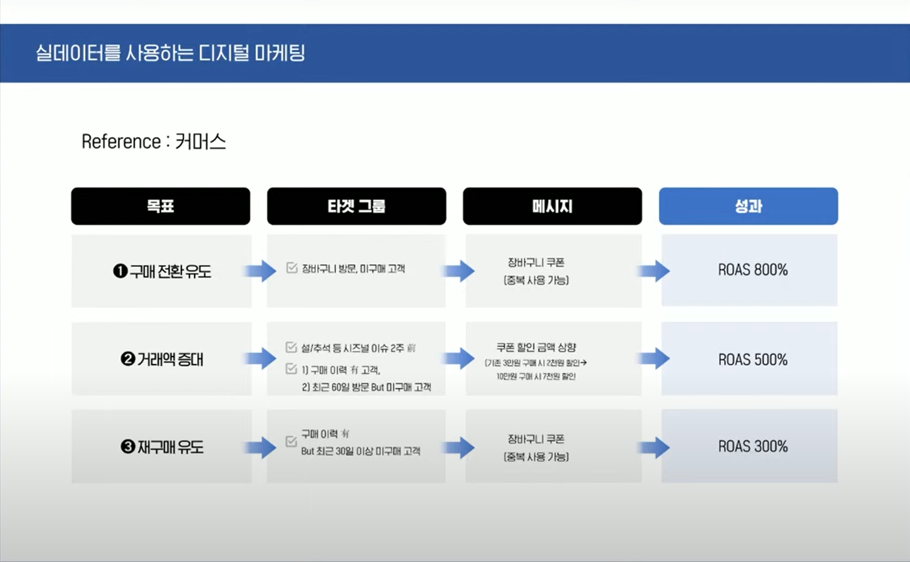
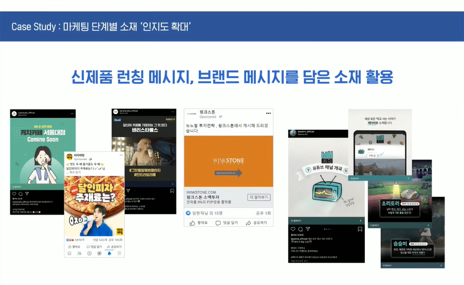
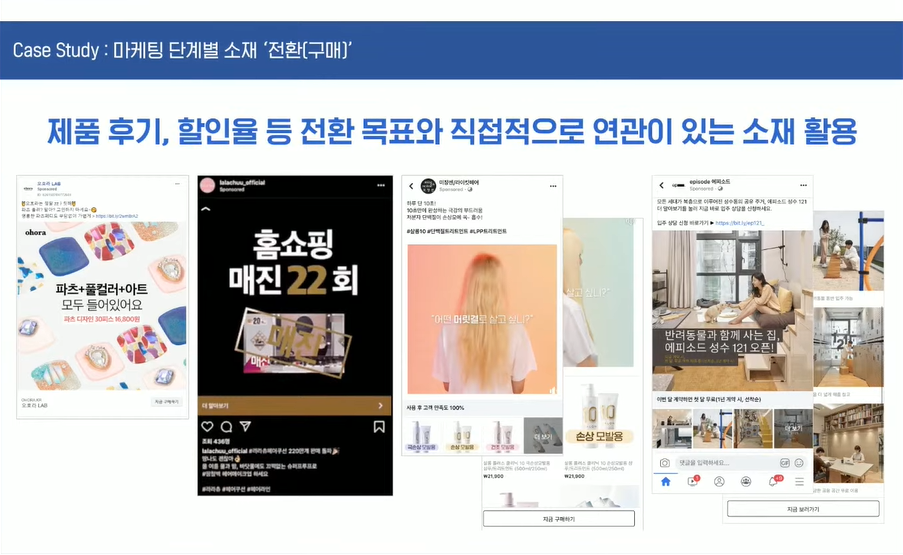
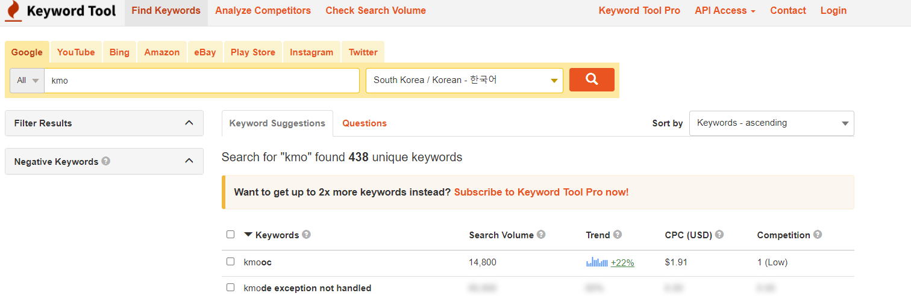

# 스타트업을 위한 GA 마케팅

장점 : GA는 실 데이터를 그대로 활용해서 온라인 광고가 가능 

#### 고객 관심사, 유입(소스/매체) 정보

- 유입 고객들이 관심있어 하는 부분 
- 어떤 매체에서 어떤 채널에서 들어오는지 
- 레퍼러 : 제 3의 사이트를 통해 들어온 

#### 유입/이탈 페이지

- 이탈율이 많은 페이지를 조금 더 최적화 해야 한다

#### 고객 인기 전환 경로, 지원 전환, 전환 기간 정보

- 인기 전환경로 : 구매 전까지 어떠한 상호작용을 통해 전환이 되는가
- 지원 전환 : 전환까지(목표) 미친 영향들...
- 전환 기간 : 전환까지 걸린 시간 

#### 꼭 해야하는 세가지 

- 목표 설정
- 잠재고객 설정
- 구글애즈와 연동

## Google 계정

> 데이터 및 맞춤설정

- 광고 개인 최적화

#### 구글의 고객 정보 수집과정

#####  구글 애즈

- 매일경제 검색
- 매일경제 사이트 들어간다
- 그 페이지 내에 있는 광고 상단 아이콘 클릭... 
- 사이트에 구글광고 있으면 그 사이트에서 어떤 항목을 보는지 행동이 모두 수집이 된다. 
- 내가 보고 있는 콘텐츠의 텍스트를 모두 크롤링해서 수집
- 아 얘는 스포츠에서 골프, 축구 등을 본다. 남성일 가능성이 높다. 등으로 고객을 정의 == 비로그인 상태에서의 추적방식(확률 데이터, 80%정도의 정확도)

##### 내 광고 ID

- 웹앱 사용 패턴 등 다 저장...

##### 위치정보

- 데이터 및 맞춤설정 > 위치기록 > 허용할 경우
- Google 지도 타임라인 > 지도 타임라인

### 수집한 고객 정보 활용

- 과거 1세대 광고 : 컨텐츠 기반으로 광고를 구매하는 방식
- 2세대 : 내 광고가 어디에 실리든 내가 원하는 사용자를 따라다닐거야

#### 인구통계 타겟팅

- 연령, 성별, 자녀 유무, 가구 소득 등 기준

#### 관심분야 타겟팅

- 특정 주제에 관심을 갖고 있는 유저 타겟팅

#### 특정 지역 방문 이력 있는 유저 

- 어디 들린 이력 있는...

#### 구글 안드로이드 윤영체계 사용 유저 앱 설치, 사용 패턴

GA4로 가는 방향이기 때문에 유니버셜에서 넘어가서 스터딩 하는게 좋다

## 리마케팅

고객군별로 세그먼트를 만들어두면 가능

우리 사이트에 들어와 흔적을 남긴 사람

네트워크 배너 : 구글의 경우 100명 중 90명에게 재도달 가능 (입간판)

동선상에 걸쳐놓는것이 유용

마케팅 퍼널에서 전환에 조금 더 가능성이 있는 사람 찾아서 따로 관리를 해야 함 !!!! 

액션 단계에서 흔적을 남긴 고객 

단계별로 고객을 나눠서 접근

### 타겟 그룹별 크리에이티브 이미지 배너 및 텍스트 전략

- 대규모 트래픽을 먼저 가져와서 세그먼팅?? 
- 서로 다른 니즈가 있는 대상에게 각각 맞춤 메시지 보내기... 
- 텍스트만 배리에이션 해도 의미가 있긴함
- 구글에 반응형 광고라는 게 있다. -> 활용?

### 커머스에서 효과적인 타게팅 사례

- 커머스의 경우 설/추석 때가 대목임
- 구매 이력 있는 고객 대상으로 크로스 셀링 등 
- DA 광고의 성과를 바라보는 관점 : ROAS 150-200% 정도면 나쁘지 않다는 수치 . 다만 퍼포먼스로 보면 안된다 이건. 배너를 통해 인지도를 높이는 효과도 있기 때문. 트래픽이 많이 필요한 초기 단계에서는 이게 굉장히 중요함. 나중에 검색을 하거나 이런 부분까지 유도하려면 이게 필요. 다른 검색광고나 SNS 광고처럼 바라보면 안됨. 

### keywordtool.io

