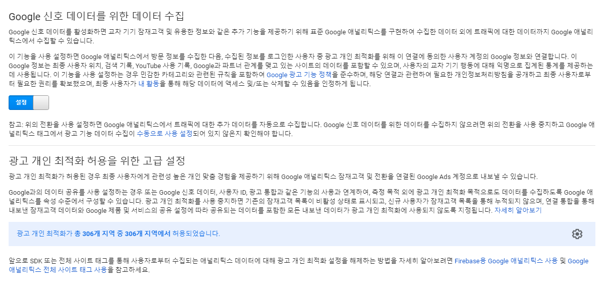

# google_analytics_remarketing

- 사이트 방문했다가 구매를 하지 않은 경우 리마케팅을 이용해 Google 디스플레이, 모바일 앱, Google 검색에서 이 사용자에게 관련 광고를 게재 가능

## 리마케팅이란?

> 웹사이트 재방문과 구매 유도
>
> 

### 애널리틱스 > 속성 설정 > 광고 기능

- 관리 섹션에서 '추적 정보' 클릭한 다음 '데이터 수집' 클릭

- 리마케팅 및 광고 보고서 기능을 '설정'으로 전환
  - 광고 개인 최적화 허용을 위한 고급 설정

- Google Ads 계정을 애널리틱스와 연결

#### 잠재고객

- 리마케팅 설정 이후 공통된 속성에 따라 사용자 그룹 타겟팅할 때 생성
- 애널리틱스 구현 이후, 리마케팅 추적 코드가 삽입된 사이트를 방문한 적 있는 **사용자의 브라우저 쿠키**로 구성

- 활용하여  사용자 타겟팅한 광고 게재 가능
  - 특정 페이지 방문했던,
  - 동영상을 클릭해서 재생했던, 등
- 애널리틱스에서 생성 시 별도의 태그 추가 필요 없음
- 단 쿠키를 삭제한 고객은 리마케팅 잠재고객에서 제외되어버림

#### 잠재고객 리마케팅

> 관리 >  (잠재고객 목록용으로 사용할 속성에서) 잠재고객 정의 > 잠재고객 > 새 잠재고객

- 잠재고객 목록을 연결할 보기와 계정 선택 후 '다음단계'
- 잠재고객을 클릭 시 , 이 잠재고객에 포함된 최근 7일의 추정 사용자 수를 확인 가능

- **세그먼트 가져오기**를 통해서 속성 내 세그먼트를 선택하거나 바로 잠재고객으로 만들기 가능
- **새 잠재고객 정의**도 가능
  - 맞춤 세그먼트 작성 도구와 매우 유사
  - 인구통계, 기술, 행동, 첫 번째 세션 날짜, 트래픽 소스, 고급 조건/순서
  - 조건 - 필터를 통해 세팅도 가능
- 구글 검색 리마케틴ㅇ
  - 잠재고객 목록에 등록된 사용자 1,000명 이상이어야 구글 광고 내 검색 리마케팅에서 활용
  - 구글 디스플레이 네트워크의 인구 통계 측정 기준 ( 연령, 성별, 관심분야 )는 검색 리마케팅에서 사용 x

## 동적 리마케팅 활용한 타겟팅 정확도 개선

> Dynamic Remarketing

- 사이트에서 본 상품의 제품 ID를 수집했다가 나중에 이 제품을 동일한 사용자에게 광고로 보여주면서 웹사이트이 재방문과 구매 유도할 수 있음

### 동적리마케팅 설정하기

1. Google Ads 계정과 애널리틱스 계정을 연걸하고, 광고 기능 사용 설정
2. 소매업체의 경우 Google Ads 계정과 Google 판매자 센터 계정도 연결
3. 동적리마케팅의 카테고리 속성을 찾아 맞춤 측정기준 만듦
4. 웹사이트 태그 업데이트
5. 동적 리마케팅용 잠재고객 생성
6. 동적 리마케팅용 속성 생성
7. Google Ads에서 동적 리마케팅 캠페인 생성
8. 고객센터 > 동적 리마케팅의 카테고리 속성 목록 확인 가능
9. 

