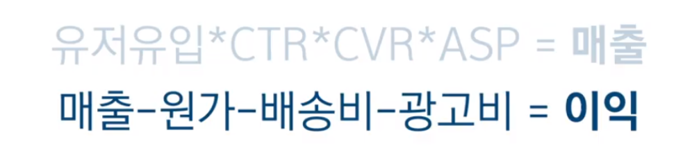

CRM 마케팅 - 개인화

2회 구매자 vs 10회 이상 구매자 > 먹히는 혜택이 다르다. 

10회 이상 구매자는 진성 고객

2회  

10회 - 선호하는 상품에 대한 낮은 할인

2회 - broad 높은 할인

성공사례 "신선플랜"

한번 배송비로 매주 무료배송

- 구매 빈도를 늘리기 위한게 목표
- 무제한무료배송?  현실적인건 주에 1회였다. 
- 레버리지 목표는 남아있는 회수에 대한 funnel를 짜서 
- 잔여 횟수를 명분으로 개인의 현재 사용 현황에 따라 푸시 시나리오를 촘촘하게 짰다

- 횟수, 기간
- 기간 안남았는데 자동 연장

-> 월별 구매 횟수 1.8회 증가

CRM 마케팅은 소화제다 

모든 funnel에서 설계를 통해 원활히 내려가서 goal에 도달할 수 있도록...

------

펫프렌즈 CMO 김용훈

리바이의 펫프렌즈 CRM

재구매 중요 고관여 시장

그로스 스택... 매트릭스에 적용 모델...

하는 모든 업무마다 metric을 만들고 각 지표마다 성과를 만들어야 함 --> funnel 깔대기

측정할 수 없으면 관리할 수 없고 관리할 수 없으면 개선할 수 없다. 정량적인 부분 정리할 것.

-- >목표(KPI)를 위한 데이터 관점의 선행 지표

metric을 본다는 것은 현재 우리 서비스의 문제를 파악하는 것

유저유입

클릭하나 안하나 

장바구니에 담나 안하나 

주문단가

== 매출

목표(KPI)는 선행지표들을 올리면 알아서 상승하게 되어있다

DAU MAU

유저유입

하나하나에 대한 메트릭 세분화

CRM은 결국 이탈하지 않게끔. 유저를 다시 오게끔 하는 것에 대한 액션

#### 사례

고객 CS 채널

오가닉 플랫폼(카카오)-> 입으로 재유입하고 싶다

#### 이전에는

친추 > 오픈 > 메뉴클릭 > 세부메뉴클릭 = 앱 유입

상품을 바꿔본다 메뉴를 바꿔본다

SPU 유저??

검색을 통한 오가닉유입

노출 되냐 안되냐

상위노출되냐 안되냐

클릭되냐 안되냐

== 오가닉유입

쿠폰에 대한 알림톡

검색을 통해 쿠폰페이지로 랜딩되면 구매율이 높더라

구구절절 설명하는 것보다

최대한 간결하게 하기

"어제보다 나은 오늘"

어려우면 그냥 작은것부터 해보기

반려동물의 DB를 봐서 반려동물의 생일을 챙긴다든지

택배에 손편지를 쓴다든지

CRM은 고객 관리인데 이런 부분들은 트래킹은 안되겠지만 돌아올거라 믿는 것

고객의 소리만 귀 기울여도 90%는 해결

24시간 CS 해결 중임

그냥 사료 상담임에도 불구하고 함

공부 관련 상담도 가능하다는 포지셔닝은 어떤가?

구매데이터 기반으로 추천, 등

검색을 통해 구매했을 때 높은 구매율

원하는 과정을 명확하게 검색했을 때 상품이 노출되게 하는 페이지

리뷰가 중요하더라

상품을 구매하면 리뷰를 최대한 쓰게끔 유도하기

리뷰 10개 이상인 상품 비율 늘리기 위한 목표

실행에 있어서 너무 거창하게 준비하지 말자

최대한 lean하게 빠르게 

-----

진성고객의 정의

- 자사 데이터 따라

알림톡-접근허들낮음 자동화

문자- ab test시에 활용

문자

푸시 

이메일

테스트하면서 ROI 관점에서 바라봄

과거 유저 데려오는건 LMS 나 문자 등

이메일은 앱이다보니 효과가 딱히

비용안들이는 유저랑

오가닉 유저의 비율 어느정도인가

첫구매 기준 반정도

오가닉을 늘리는 방법에 대한 고민 중

로하스 가성비 오가닉

트래킹 툴은 어떤거 쓰나

- 에어브리지  -월 100만
- 엠프리튜드? ?
- GA FA -자꾸 누락되는 문제는 있음

펫프는 Amplitude 쓰네요 (유료 버전을 쓰는지는 모르겠습니다) 안드로이드 앱 중에 Addon Detector 라는 걸 쓰시면 어떤 SDK 깔려 있는지 볼 수 있어요

도입에서 실제 반려동물에 대한 **정보 등록하게끔하는 방식**

진성 고객을 위한 CRM - 재구매 고객을 위해서는 뭘 하는지

고객에 따른 특혜 차별화하는 중,, 개인화 맞춤 쿠폰

Simpson Gyu Sup Sim알림톡 템플릿 검수 통과 하는 방법 있지 않나요? ㅎㅎ

Simpson Gyu Sup Sim템플릿 위에는 다른 static message 를 붙일 수 있는 거 같던뎅

알림톡 -> SMS fall back 이 약간 기본인듯한데, SMS 만 사용하신 거 저도 궁금하네요

GTM 으로 채널톡에 이벤트 보내서 event based trigger 할 수 있을거에요

음식점 카테고리별 push engagement rate 을 알아보고 최적화하면 되겠네요 	

CS와 배송, 신뢰가 리텐션이 높은 비결인 것 같다

CS도 반려동물 자격증 있는 사람들이 하는 중 

#### 리뷰 작성을 위해 하는 마케팅

- 리뷰를 10개 작성하는 5천원 쿠폰
- 배송 후 며칠 뒤에 알림톡 보냈을 때 리뷰작성율이 높은지 트래킹 중이라고 함

노세일 정책

태핑을 위한 명분으로 할인혜택을 활용하기 때문에 거기서 조금 아낌

테스트 주기?

보낼때 고객의 피로도 최소화하기 위해 나눠서 함

주기보다는 수치 따라 실행

푸시시나리오는 어떻게 짜는지

기획단에서 목표에서 시작. 고객의 사후 데이터 따라 기준 세분화

어느정도 정해지고 나면 시뮬레이션 해보면서 복기, 그리고 완성

푸시테스트 - 전체푸시는 큰 프로모션 아닌 이상 자제. 강아지 패드 구매하거나 장바구니 담은 이력 있는 사람한테만 보낸다 와 같이 피로도를 그나마 낮추려고 함. == 개인화가 중요

재구매 주기가 긴 제품의 경우?

CDP  - >유저마다 홈에서 보여주는 페이지가 다 다른 것(이상적)

앱설치 이전단계? 

Life time value  장기적으로는 앱으로 데려오는 것이 좋다

페북 인스타 구글 uac 카카오 비즈모델 애드테크 등 활용 중 

 

테스트에 대한 대조군이 무조건 필요하다

작게 줄여서 비교해보기 

------

## 채널톡 내 마케팅 기능 활용법

고객데이터를 최대한 모으고 분석할 수 있어야 

고객연락처 내에서 CRM 정보 확인 가능

필터 활요 할 수 있음

- 회원가입할 때 남는 정보 
- 빌더사에서 제공하는 값들 확인// 직접 구현하면 설정 수정 가능
- 상담 시작 전 정보 입력 유도해서 비회원이더라도 수집 가능

원하는 타겟 고객을 선택할 수 있음. ex) 회원이면서 장바구니에 1개 이상 있는 뭐 그런 기준

엑셀 같음

고객의 프로필 메뉴에서 특정 고객의 모든 정보 확인 가능

- 메일, 접속일자, 브라우저, 유입경로 등
- 고객과 커뮤니케이션한 이력, 전화 등
- 고객의 행동 페이지 이동 로드맵

고객에게 말걸기

- 원하는 고객 정해서 말걸기

- 특정 액션 취한 고객에게 자동화해서 말걸기
- 개인화 변수를 활용하면 수집되어있는 이름으로 개인화 설정 가능

#### 일회성

- 메시지

#### 캠페인

- ab test 가능
- 어떤 메시지가 먹힐지 모른다
- 조회율 높은 메시지 확인
- 대상고객 설정 : 서울접속자 중 가입하고 2주동안 구매가 없으면 매주 월요일 아침 9시에 전송
- 시작이벤트, 대기시간, 추가이벤트 필터, 스케쥴링
- 서포트봇으로 연결도 가능
- 목표값 설정 

b2b는 자동화 마케팅이 중요

