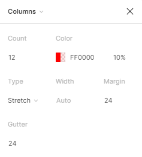

#  반응형 웹을 위한 layout grid

>  다양한 해상도의 웹, 모바일 환경에 대응하여 프로덕트 제작 시, 전달하려는 정보의 완성도를 유지하기 위해, 일관성 있는 `레이아웃 그리드` 규칙이 필요함.

- 구글의 머터리얼 가이드 참고

## Layout Grid 구성요소

1. Margin: 콘텐츠 영역 밖의 좌우 여백
   - 
2. Column : 해상도 세로 열
   - 콘텐츠 영역 안의 세로 그리드
3. Gutter : Column과 Cloumn 사이의 여백

> grid system은 개발 플랫폼, Framework 그리고 해상도에 따라 달라짐

### Frame 

- Frame을 원하는 Device 사이즈에 맞춰서( ex. Desktop) 만들고 Design > Layout Grid > Grid를 Columns로 바꾼다

이런식으로 데스크탑에 해당하는 칼럼의 마진과 거터를 맞추고 안드로이드 등에서의 레이아웃그리드도 맞춘다

### Auto layout & Frame

- 컴포넌트 만들기 : Ctrl + Alt + k
- 텍스트를 클릭한 상태에서 Ctrl  + a // 오토프레임 기능
  - 일반 프레임과 다른 형태의 프레임이 만들어진다

### Components

- 반복적으로 사용될 ui assets를 의미
- 