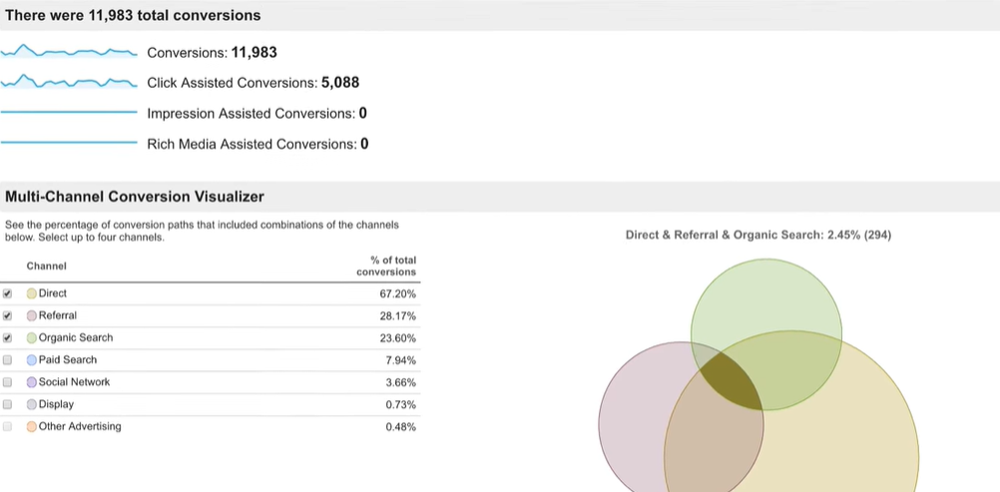
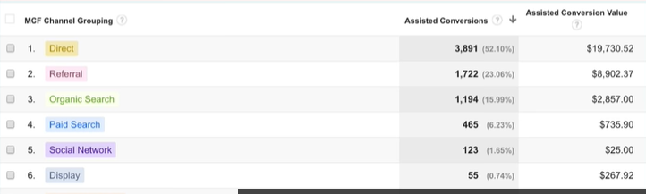
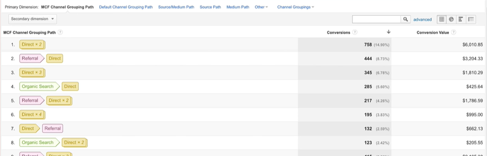
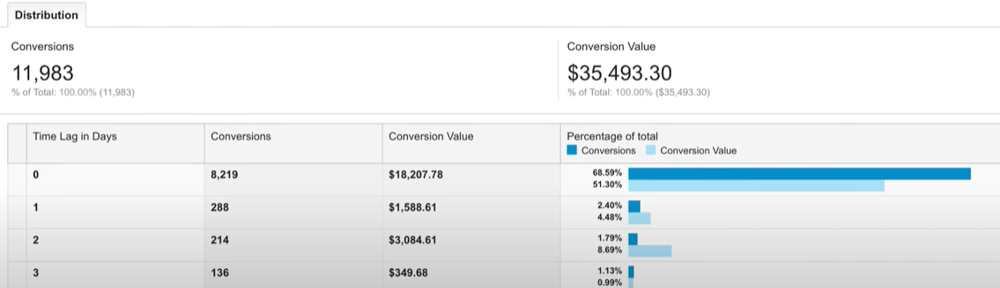
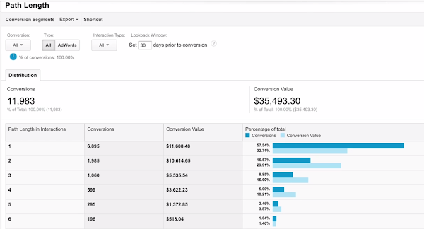

# google_analytics_advanced analyzing tools and methods

## [통계를 위한 세그먼트 데이터]

### 1. 세분화란?

> 보고서에서 하위 집합의 데이터를 조회하는 방식

- **사용자 세그먼트** : 최대 90일의 여러 세션이 포함될 수 있음
  - 특정 연령, 기간, 성별 또는 이들의 조합으로 이루어진 데이터만 표시되도록 만들 수 있음
- **세션 세그먼트** : 단일 세션에서 발생하는 사용자 행동으로 한정
  - 사용자가 하나의 세션에서 도달한 목표나 발생시킨 수익을 세션 세그먼트로 만들 수 있음

- 사용자 세그먼트와 세션 세그먼트는 측정기준, 측정항목, 세션 날짜를 이용해 만들 수 있으며, 사용자 액션의 순서를 이용해서도 만들 수 있음
- 세그먼트는 삭제하거나 애널리틱스를 종료할 때까지 **모든 보고서에 계속 적용**됨
- 한 번에 최대 4개의 세그먼트 비교 가능

### 2. 세그먼트 유형

#### 기본 세그먼트

- 기본으로 제공되며 '**시스템**' 섹션에 표시

#### 맞춤 세그먼트

- 사용자가 직접 만들며 '맞춤' 섹션에 표시
- 인구통계, 기술환경, 행동, 세션 날짜, 트래픽 소스, 전자상거래(웹사이트에 구축된 경우)를 기준으로 만드는 것 가능
- 고급 세그먼트 : 측정기준과 측정항목을 입력된 특정 값에 일치시키는 것도 만들 수 있음
- 사용자 **상호작용의 순서에 기반한 세그먼트** 만들 수 있음
  - 특정 페이지 조회한 후 영상을 시청하는 사용자 등
  - 페이지뷰, 이벤트 혼합 가능

## [다중채널 유입경로 보고서 ( MCF )]

> Multi-Channel Funnel report
>
> 채널 보고서와 다중 채널 기여 보고서를 사용하면 비즈니스 캠페인의 성공 여부를 측정 가능
>
> 어떤 캠페인이 전환 유도에 가장 효과적이었는지

- 구글 애널리틱스 기본 설정에서는 마지막 마케팅 활동이 전환(전자상거래 수익)에 100% 기여했다고 간주(last-click attribution)
- but 다른 마케팅 활동의 기여도 인정해야 할 필요 있을 경우
- 분석 범위가 마지막 클릭 기여에만 국한되지 않도록
- 마지막 상호작용 이전에 전환에 기여한 채널은 '**지원 전환'의 범주에서 분석**
- 

#### 보고서(전환 섹션 내) 내용

- 최초의 관심에서 구매까지 **소요된 시간**도 알 수 있음. 
- **전환 경로 데이터** : 유료 및 자연 검색, 추천 사이트, 제휴사, 소셜 네트워크, 이메일 캠페인 등 거의 모든 디지털 채널에서 발생한 상호작용이 포함됨
- **다중채널 유입경로** : 사용하려면 먼저 목표 또는 전자상거래를 설정해야 함

### 1. 개요 보고서

- 사이트의 **전체 전환수**와 **클릭 지원, 노출 지원 및 리치 미디어 지원 전환수**를 확인 가능

- 전자상거래, 개별 목표, 구글애즈 등 설정 시 이것도 확인 가능
- **전환 추적 기간** : 1~90일 범위 내 설정 가능
- 타임라인 아래 각 채널의 기여도와 중복된 위치 시각적 확인 가능

### 2. 지원 전환 보고서

- 지원 판매 및 전환의 횟수와 금액을 채널별로 분류하여 확인 가능
- 숫자 == 채널이 전환에 기여한 정도

### 3. 인기 전환 경로 보고서

- 전환으로 이어진 채널 조합의 전환수와 전환 가치 확인 가능

###  4. 소요 시간 보고서

- 최초 관심부터 전환까지 걸린 일수 기준으로 전환 분류
- 사용자가 구매까지 시간이 얼마나 소요되는지 확인 가능
- --> 리마케팅 캠페인 만들기 가능

### 5. 경로 길이 보고서

- 전환 발생까지 발생한 상호작용의 평균 횟수와 각 상호작용 조합의 가치 확인 가능

## [잠재고객별 데이터 분석]

> 잠재고객 분석에서 활동, 동질 집단, 벤치마킹 이용 가능

