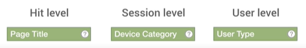
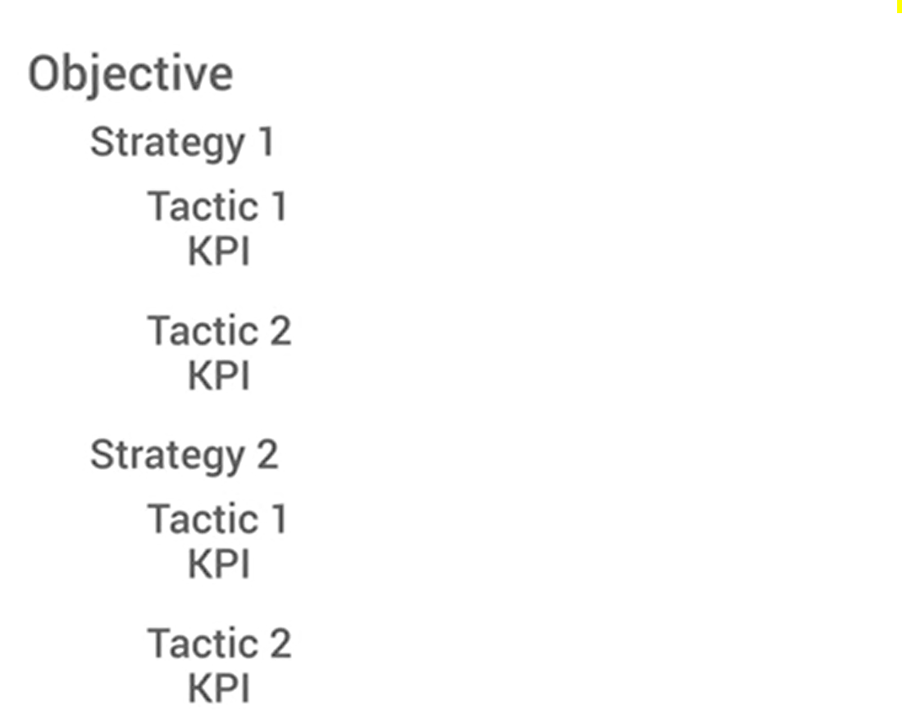

# google analytics_collecting and processing data

## [웹사이트 데이터 수집]

- 애널리틱스 추적 코드에서는 추적하는 웹사이트의 도메인이 사용되며, 보고서에서 이 도메인이 '사이트'로 지정됨
- **도메인이 다른 페이지**에 걸쳐 동일한 기본 추적 코드를 설치하는 경우
  - 사용자와 세션 등을 별도로 집계하게 됨
  - 여러 도메인에 걸쳐서 사용자 트래킹 하려면 **'교차 도메인 추적'**을 설정해야함

### '조회' 분석 (hit)

- 사이트 내에서 사용자 상호작용이 발생할 때마다 추적코드가 'hit'을 애널리틱스로 전송
- '조회(hit)' : 유저들에 대한 유용한 정보의 매개변수가 있는 URL 문자열임
  - 임의로 생성된 사용자 식별자와 같은 정보도 포함 - 이걸로 신규/재방문자 구분
  - 3가지 유형 : **페이지뷰(pageview hits), 이벤트(event hits), 거래(transaction hits)**

#### 페이지뷰

- 추적 코드가 삽입된 **웹페이지가 로드** 될 때 실행됨. 열 때마다 전송됨

#### 이벤트

- 웹사이트의 특정 요소와 상호작용하는 매 순간 추적 가능
- URL에서 **이벤트 액션, 카테고리, 라벨, 값** 등 4개의 데이터 매개변수가 전송

#### 거래

- transaction hit A.K.A E-commerce hit(전자상거래 조회)
- 구매한 제품, 거래 ID, 재고 보관 단위(SKU : Stock Keeping Units)와 같은 전자상거래 구매 관련 데이터를 애널리틱스로 전송

#### 기타 조회들

- 소셜 조회 : 좋아요, 공유 또는 트윗 데이터를 전송

## [사용자와 세션으로 데이터 분류하기]

- 먼저, 애널리틱스에서 **신규 사용자와 재사용자**를 구분합니다.
- 그런 다음, 조회를 **세션(사용자가 사이트에 참여한 시간)**으로 분류합니다.
- 마지막으로, 추적 코드의 데이터를 **다른 데이터 소스와 결합**합니다. 

### 신규 / 재방문자

- 추적코드가 있는 페이지 방문할 때  사용자의 브라우저 쿠키와 연결되는 임의의 고유 ID 생성
- but 쿠키를 톻해 인식하므로 웹브라우저에서 **쿠키**가 삭제 또는 차단되면 사용자 정보 날아감 ( 쿠키 삭제하면 ID 새로 발급 == 새 방문자로 인식 )
- **여러 세션에 걸쳐** 사용자를 인식할 수 있음(단, 동일한 기기 동일한 브라우저에서 발생한 세션이어야 함)
  - 애널리틱스의 기본 설정에서는 다른 기기에서 웹사이트를 방문한 사용자를 인식하지 않지만, 각 기기를 고유 사용자로 집계
  - 여러 기기에서 사용자를 추적하려면 **User ID** 기능을 사용해야 함

### 세션 정의

- 웹사이트에서의 사용자 참여 수준을 파악하기 위해 **조회의 생성 시간**에 기초해 사용자 조회를 분류 - 이 때 사용하는 측정항목이 **세션수**
- 일반적인 카운팅
  - 웹사이트에서 사용자가 Google 애널리틱스 추적 코드가 있는 페이지로 이동할 때 세션이 시작되고 '페이지뷰' 조회가 생성됨
  - 이 조회는 다른 조회가 기록되지 않으면 30분 후에 종료됨
  - 세션이 종료한 후에 사용자가 페이지로 돌아가면 새 세션이 시작됨.
  - <u>그럼 히트가 계속 기록되면 세션은 30분 넘게 유지가 된다는건가?</u>
- 기본적으로는 30분이 세션 제한시간 : 사이트에서의 사용자 행동을 반영하여 구성에서 이 설정 **변경 가능**

### 애널리틱스 데이터와 다른 소스 연결하는 방법

#### 1. measurement protocol (측정 프로토콜) 이용

- 이게... 뭔데 글애서... 
- **URL 문자열을 통해 데이터 수집 조회를 직접 전송** : 추적코드는 자동으로 조회를 전송. but  google 외의 시스템으로부터 데이터 수집하기 위해서는 이 방법 필수
- 맞춤 추적 ID를 이용해 조회를 구성하는 방법과 이들 조회를 지정된 Google 애널리틱스 계정으로 전송하는 방법임 ????????? 

#### 2. 구글의 다른 마케팅 툴과 연결 

- Google Ads, 애드센스, Google Search Console

## [구성 설정 적용하기]  ( Applying configuration rules)

> 데이터 필터, 목표, 데이터 분류, 맞춤 측정기준, 맞춤 측정항목, 데이터 가져오기 등의 규칙을 수정해서 더 세밀한 분석하기

### 1. 데이터 필터

- 필터 : Google Anaytics에서 처리 중인 데이터에 적용하는 '규칙'을 말함
- 보기에서 특정 데이터를 제외/포함 혹은 처리 중인 데이터를 수정하는 필터를 설정할 수 있음
- true - 필터 적용 / false - 필터 적용 X

#### 필터 사용이 필요한 경우

1. 내부 직원 트래픽을 제외하려는 경우
2. 보기에 표시되는 데이터를 변환하려는 경우

### 2. 목표

#### 1) Destination / Pageviews

- 웹사이트에서 사용자가 특정 페이지를 조회하는 것이 목표인 경우

#### 2) Event

- 이벤트로 정의된 특정 행동이 실행되는 것이 목표인 경우

#### 3) Duration

- 세션이 일정 시간 이어지는 것이 목표

#### 4) Pages/Screens per Session

- 한 세션에서 일정 수 이상의 페이지를 조회하는 것이 목표

> Conversion(전환)은 세션당 한 번만 집계됨. 한 세션 내 백날 같은 동작 반복해도 하나로 카운트됨

#### * 보고서에 포함되는 통계

- 목표 달성 goal completions
- 목표 가치 goal  value (지정한 경우만)

- 목표 전환율 goal conversion rate

### 3. 채널 그룹 및 콘텐츠 분류

- 채널 그룹 : 애널리틱스 표준 보고서가 아닌 다른 방식으로 구성하고 싶은 경우 활용

- 콘텐츠 분류 : 웹사이트의 구성에 따라 보고서에서 측정항목 통합 가능

### 4. 맞춤 측정기준 / 맞춤 측정항목

>  맞춤 측정항목을 이용하면 비즈니스에 해당하는 측정항목 데이터 그룹을 지정한 후 이를 보고서 전체에서 측정기준으로 적용할 수 있음

- 자체 데이터를 Google 애널리틱스에 업로드할 수 있습니다. 이러한 자체 데이터에는 조회 데이터, 맞춤 측정기준이나 맞춤 측정항목에 저장된 확장 데이터, 그리고 업로드된 측정항목을 요약할 수 있는 요약 데이터 등이 있습니다. 일반적으로 이 정보는 오프라인 비즈니스 도구(예: 콘텐츠 관리 시스템, 고객 관계 관리 시스템)에서 텍스트 파일로 내보내는 정보

- +) 애널리틱스에서 자동으로 추적하지 않는 데이터를 수집/분석 가능

- https://support.google.com/analytics/answer/2709828?hl=ko

  

### 5. 데이터 가져오기

> 애널리틱스가 수집한 조회 데이터 + 오프라인 데이터 결합 가능

- **데이터 처리 완료 후에는 해당 데이터의 구성 설정을 소급해서 적용할 수 X**

## [데이터 저장 및 보고서 생성] 필터링... 어렵다

> 행 : 측정기준 ( 데이터의 속성 )
>
> 열 : 측정항목 데이터 ( 정량적 측정 요소 )

### 측정항목의 집계방식 ★

#### 1. 통합집계 

- 총 세션수, 사용자 수, 페이지뷰 수와 같은

#### 2. 구체적인 측정 기준에 따라 집계 

- ex) 세션수, 국가당 신규 사용자 수

#### * 페이지에 머문 시간

- 다음 페이지뷰 조회 시각 - 현재 페이지뷰 조회 시각

#### * 세션당 페이지수 ( Pages / Session )

- 사용자가 세션에서 발생시킨 순페이지뷰 조회수의 평균값

#### * 평균 세션 시간

- 사이트 이탈 or 세션의 제한시간 종료되기 전 첫번째 조회~마지막 조회까지 이어진 평균 시간

#### * 이탈률 ( Bounce Rate )

- 세션 시간이나 페이지에 머문 시간을 계산하기 위해 사이트에서 상호작용을 한 번만(두번째 상호작용 X) 발생시킨 사용자를 분석하는 과정에서 계산됨
- 이탈 발생 : 이 방문의 페이지뷰에 할당된 세션 시간, 페이지에 머문 시간 == 0

### 측정기준/항목이 데이터에 적용되는 범위

> 측정기준과 측정항목 생성 시 이들이 데이터에 적용되는 범위를 정해야 함.
>
> **범위가 동일**한 측정기준과 항목만 쌍으로 연결 가능

#### 범위

- 조회 수준 (Hit level)
- 세션 수준(Session level)
- 사용자 수준(User level)

## [측정 계획 수립]

>  비즈니스마다 거시전환(macro conversion)과 미시전환(micro conversion)이 다름

- 거시전환 : 비즈니스 목표 충족하는 핵심 행동 ( 구매 등 )

- 미시전환 : 기본 목표에 도달하도록 유도하는 좁은 의미의 목표 ( 이메일 쿠폰 신청 등. 프라이빗 노트의 경우 '체험권 신청' )

- 측정 계획에는 전체적인 비즈니스 **목표**, 이 목표를 지원하는 다양한 **전략**, 전략 달성에 도움이 되는 **전술**이 포함되어야 함

--> 즉 거시전환수와 미시전환수를 먼저 파악해야 함. 

수강신청과 체험신청 파악!

https://analytics.google.com/analytics/academy/course/7/unit/1/lesson/5

참고해서 측정 계획 수립하기