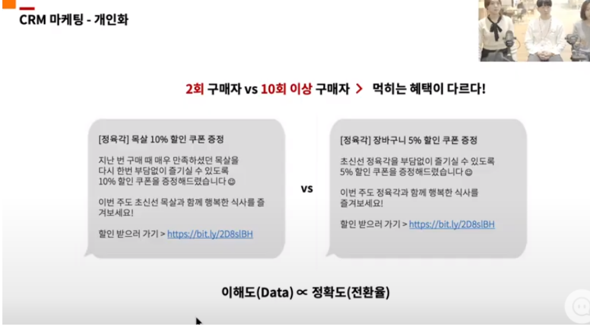
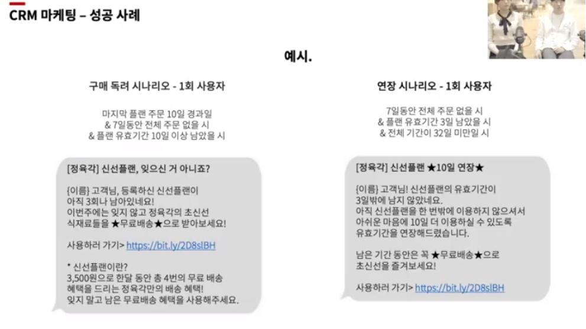
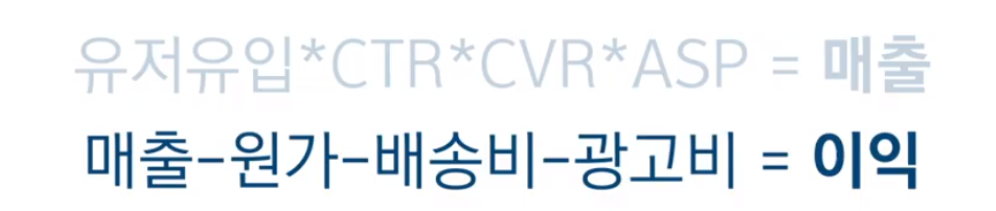
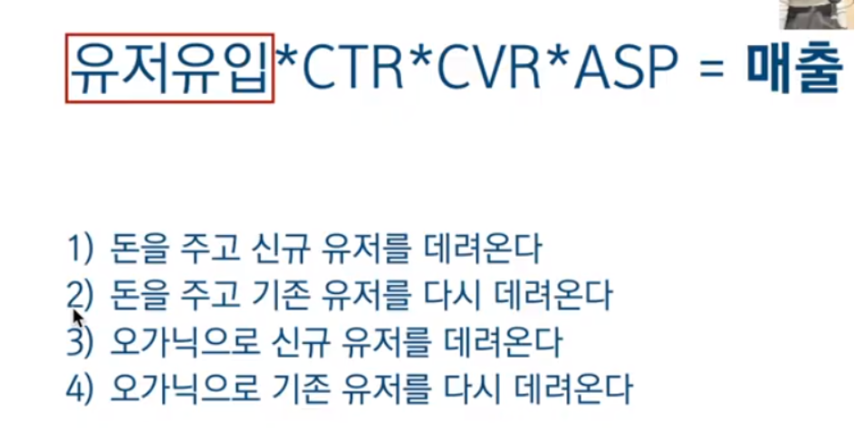
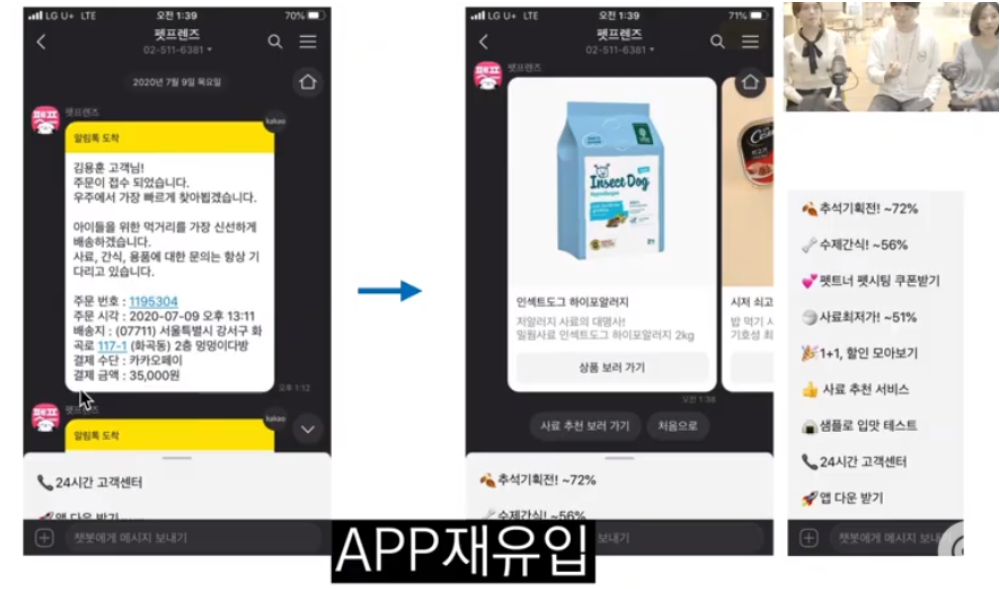
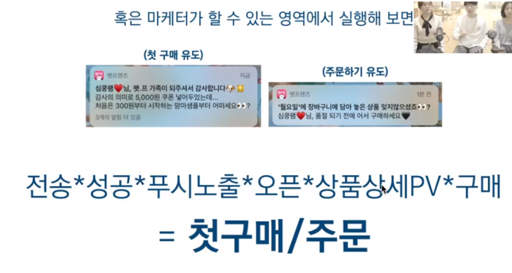
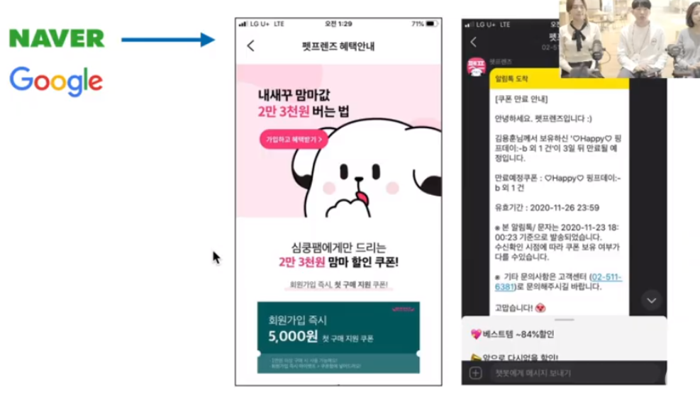
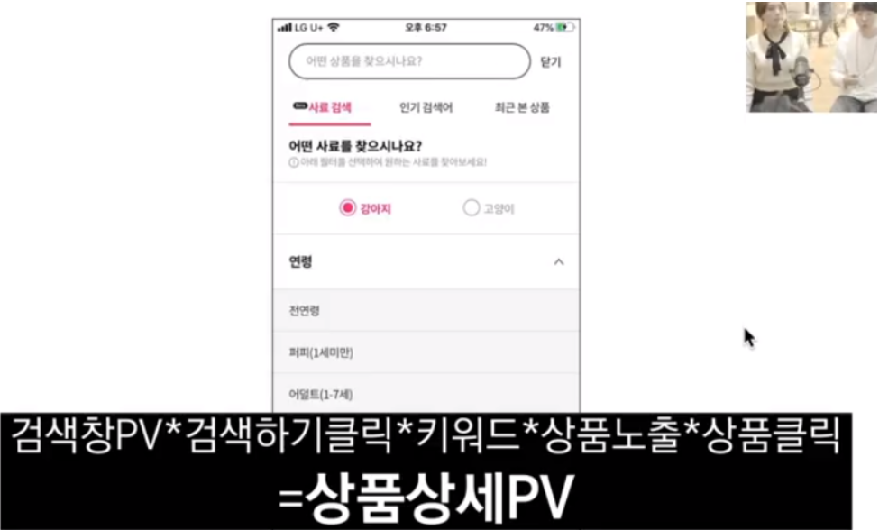
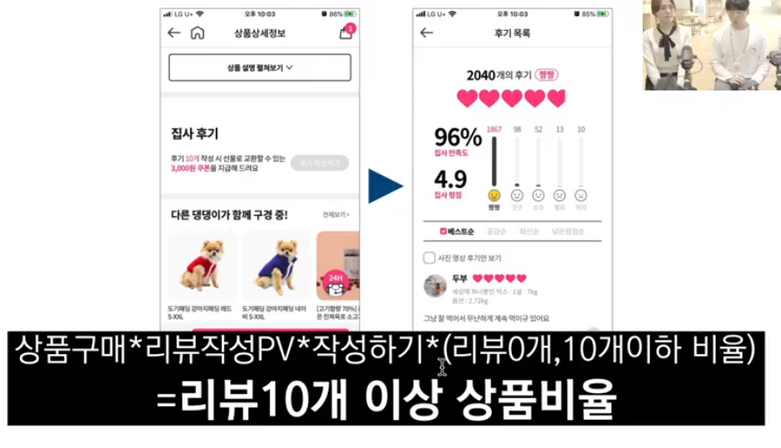

# 채널에듀_ CRM 마케팅

### [정육각] CRM 마케팅 사례

- CRM 마케팅은 개인화
  - 진성구매자 ( 꾸준히 구매를 일으키는 고객 ) 와 아닌 구매자에 대한 분리 필요
  - 진성구매자를 정의하는 것에 대한 기준도 필요

### 고객마다 혜택도 개인화

- 10회 이상 구매자의 경우 : 선호하는 특정 상품(개인화)에 대한 낮은 할인율의 쿠폰
- 2회 구매자의 경우 : 넓은 범위의 상품에 적용 가능한 높은 할인율의 쿠폰

### 성공사례 "신선플랜"

> 한번의 배송비로 매주 무료배송 받자! 

#### 한계 극복 방식

- 목표 : 구매 빈도를 늘리기 위한 목표
- 다른 곳에서는 무제한 무료배송(쿠팡 등) 서비스를 진행 중이었으나 자사에서는 그런 서비스 진행은 어려움. 현실적인 것은 주에 1회
- 주에 1회만 가능하다 >> "매주 무료배송" 워딩의 차이로 다르게 보이는 듯함
- 레버리지 목표는 남아있는 고객들 회수에 대한 funnel을 짜서 달성할 것
- 잔여 횟수( 주 1회 아직 사용 안했다, 아직 한 번도 사용 안했다 등)를 명분으로 개인의 현재 사용 현황에 따라 푸시 시나리오를 촘촘하게 짰다

- 횟수, 기간에 따른 푸시 알림
- 기간 얼마 남지 않은 서비스에 대한 자동 연장 푸시 알림

#### 결론

- 월별 구매 횟수 1.8회 증가
- CRM 마케팅은 소화제다 
- 모든 funnel에서 설계를 통해 원활히 내려가서 goal에 도달할 수 있도록...

------

### [펫프렌즈] CRM 마케팅 사례 _ CMO 김용훈

#### 반려동물용품 시장

- 재구매가 중요한 고관여 시장
- 그로스 스택... 매트릭스에 적용 모델...
- 하는 모든 업무마다 metric을 만들고 각 지표마다 성과를 만들어야 함 --> funnel 깔대기

- 측정할 수 없으면 관리할 수 없고 관리할 수 없으면 개선할 수 없다. 정량적인 부분 정리할 것.

## Metric

- 목표(KPI)를 위한 데이터 관점의 선행 지표

- metric을 본다는 것은 현재 우리 서비스의 문제를 파악하는 것

#### 일반적인 커머스의 Metric 구조

- **유저유입 * CTR * CVR * ASP = 매출**

  - **이걸 올리든가**

  - 유저유입 : 트래픽

    CTR : 클릭하나 안하나 

    CVR : 장바구니에 담나 안하나 

    ASP : 주문단가

    == 매출

- **매출 - 원가 - 배송비 - 광고비 = 이익**

  - **이걸 낮추든가**

목표(KPI)는 선행지표들을 올리면 알아서 상승하게 되어있다

DAU MAU

#### 유저유입

> 유저를 데려오는데에 총 4가지 방식이 있음

- 하나하나에 대한 metric 세분화 할 것
- CRM은 결국 유저들이 이탈하지 않게, 다시 오게 하는 것에 대한 action

### [앱 유입] 성공 사례

#### 고객 CS 채널

- 오가닉 플랫폼(카카오)에서 앱으로 재유입 시키는 것이 목적
- 상품, 메뉴 배치 등을 바꿔본다
  - 친추 > 오픈 > 메뉴클릭 > 세부메뉴클릭 = 앱 유입
  - AB test 등을 진행해서 계속 변화를 주고 수치 측정

SPU 유저??(모르겠음)

#### 검색을 통한 오가닉유입

- 노출 되냐 안되냐

- 상위노출되냐 안되냐

- 클릭되냐 안되냐

- == 오가닉유입

#### 쿠폰에 대한 푸시알림

#### 쿠폰에 대한 알림톡

- 검색을 통해 쿠폰페이지로 랜딩되면 구매율이 높더라
- 구구절절 설명하는 것보다 최대한 간결하게 하기
  - 뭐하면 뭐준다. 직관적으로 보이도록

#### 데이터에 따른 변화 _ 검색을 통한 높은 구매율

- 원하는 과정을 명확하게 검색했을 때 상품이 노출되게 하는 페이지
- 구매데이터 기반으로 추천 등

#### 데이터에 따른 변화 _ 리뷰 10개 이상인 상품 비율 늘리기 목표

- 리뷰가 많은 상품에 대한 구매율이 높다는 데이터
- 리뷰가 중요하구나
- 상품을 구매하면 리뷰를 최대한 쓰게끔 유도하자
- 리뷰 10개 이상인 상품 비율 늘리기 위한 목표

#### 결론

> "어제보다 나은 오늘"

- 어려우면 그냥 **작은것부터 해보기**
  - 반려동물의 DB를 봐서 반려동물의 생일을 챙긴다든지
  - 택배에 손편지를 쓴다든지
  - CRM은 고객 관리인데 이런 부분들은 트래킹은 안되겠지만 돌아올거라 믿는 것

- **고객의 소리만 귀 기울여도 90%는 해결**
  - 24시간 CS 해결 중임
  - 그냥 사료 상담임에도 불구하고 함
  - *프라이빗노트도 공부 관련 상담도 가능하다는 포지셔닝이 가능할까*

- 실행에 있어서 너무 거창하게 준비하지 말자
  - 최대한 lean하게 빠르게 

-----

## QnA

#### 진성고객의 정의

- 자사 데이터 따라

#### 알림톡과 문자를 쓰는 상황

- 알림톡 -> SMS fall back 이 약간 기본
  - 알림톡-접근허들낮음 자동화
  - 문자- ab test시에 활용

문자, 푸시, 이메일 등이 있겠지만

테스트하면서 ROI 관점에서 바라봄

과거 유저 데려오는건 LMS 나 문자 등

이메일은 앱이다보니 효과가 딱히

- 알림톡의 경우 템플릿 검수과정이 있음

- 알림톡 템플릿 검수 통과 하는 방법 있음.
  - 템플릿 위에는 다른 static message 를 붙일 수 있는 거 같던뎅

- GTM 으로 채널톡에 이벤트 보내서 event based trigger 할 수 있을거라함

- 음식점 카테고리별 push engagement rate 을 알아보고 최적화하면 되겠네요 	

#### 비용안들이는 유저랑 오가닉 유저의 비율 어느정도인가

첫구매 기준 반정도

오가닉을 늘리는 방법에 대한 고민 중

펫프렌즈의 중요한 키워드 : ROAS 가성비 오가닉

#### 트래킹 툴은 어떤거 쓰나

- 에어브리지  -월 100만
- 엠프리튜드  Amplitude 유료버전인지는 모르겠음
- GA FA -자꾸 누락되는 문제는 있음

안드로이드 앱 중에 Addon Detector 라는 걸 쓰시면 어떤 SDK 깔려 있는지 볼 수 있음

- 앱 인트로에서 실제 반려동물에 대한 **정보 등록하게끔하는 방식**

#### 진성 고객을 위한 CRM - 재구매 고객을 위해서는 뭘 하는지

- 고객에 따른 특혜 차별화하는 중,, 개인화 맞춤 쿠폰

- CS와 배송, 신뢰가 리텐션이 높은 비결인 것 같다
- CS도 반려동물 자격증 있는 사람들이 하는 중 

#### 리뷰 작성을 위해 하는 마케팅

- 리뷰를 10개 작성하는 5천원 쿠폰
- 배송 후 며칠 뒤에 알림톡 보냈을 때 리뷰작성율이 높은지 트래킹 중이라고 함

#### 노세일 정책

태핑을 위한 명분으로 할인혜택을 활용하기 때문에 거기서 조금 아낌

#### 테스트 주기?

- 알림 등 보낼때 고객의 피로도 최소화하기 위해 나눠서 함

- 주기보다는 수치 따라 실행

#### 푸시시나리오는 어떻게 짜는지

- 기획단에서 목표에서 시작. 
- 고객의 사후 데이터 따라 기준 세분화
- 어느정도 정해지고 나면 시뮬레이션 해보면서 복기, 그리고 완성
- 푸시테스트 - 전체푸시는 큰 프로모션 아닌 이상 자제. 강아지 패드 구매하거나 장바구니 담은 이력 있는 사람한테만 보낸다 와 같이 피로도를 그나마 낮추려고 함. == 개인화가 중요

#### 재구매 주기가 긴 제품의 경우 어떻게 트래킹하는가

CDP  - >유저마다 홈에서 보여주는 페이지가 다 다른 것(이상적)

앱설치 이전단계? 

Life time value  장기적으로는 앱으로 데려오는 것이 좋다

페북 인스타 구글 uac 카카오 비즈모델 애드테크 등 활용 중 

 

테스트에 대한 대조군이 무조건 필요하다

작게 줄여서 비교해보기 

------

## 채널톡 내 마케팅 기능 활용법

> 고객데이터를 최대한 모으고 분석할 수 있어야 

- 고객연락처 내에서 CRM 정보 확인 가능

### 필터 활용

- 회원가입할 때 남는 정보 
- 빌더사에서 제공하는 값들 확인// 직접 구현하면 설정 수정 가능
- 상담 시작 전 정보 입력 유도해서 비회원이더라도 수집 가능

원하는 타겟 고객을 선택할 수 있음. ex) 회원이면서 장바구니에 1개 이상 있는 뭐 그런 기준

엑셀 같음

### 고객의 프로필 메뉴에서 특정 고객의 모든 정보 확인 가능

- 메일, 접속일자, 브라우저, 유입경로 등
- 고객과 커뮤니케이션한 이력, 전화 등
- 고객의 행동 페이지 이동 로드맵

### 고객에게 말걸기

- 원하는 고객 정해서 말걸기

- 특정 액션 취한 고객에게 자동화해서 말걸기
- 개인화 변수를 활용하면 수집되어있는 이름으로 개인화 설정 가능

#### 일회성

- 메시지

#### 캠페인

- ab test 가능
- 어떤 메시지가 먹힐지 모른다
- 조회율 높은 메시지 확인
- 대상고객 설정 : 서울접속자 중 가입하고 2주동안 구매가 없으면 매주 월요일 아침 9시에 전송
- 시작이벤트, 대기시간, 추가이벤트 필터, 스케쥴링
- 서포트봇으로 연결도 가능
- 목표값 설정 

b2b는 자동화 마케팅이 중요

