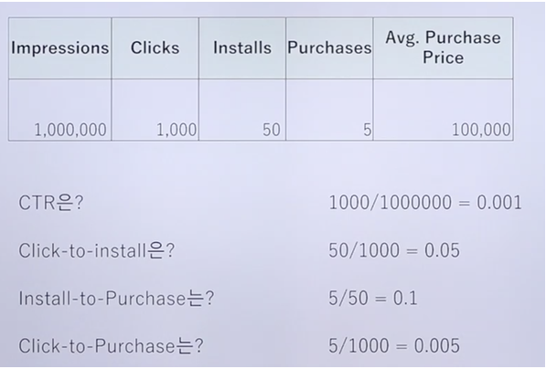

# Marketing 목표

**목표 = 체험권 신청**

## 지표

- 판매 개수 : 현 3-400 // 연 1000개 목표
- 구매 전환율 : 체험—>구매 40% 신규 —> 구매 2%
- 사이트 유입 : 현재 일 평균 신규 방문자 45명 하루 1명 정도 결제한다고 볼 수 있음
- 1인당 획득 비용?
- 1개당 판매 비용 : 40-300만원

# 툴 관점

## 1. 고품질 유저

- 누구에게 집중해야 하는가
- 나이 성별 지역 시간대
- 채널톡

## 2. 고효율 매체

- 어떤 source에서 유입된 유저들이 가장 목표를 잘 달성하는가
- 예산 효율 고려
- hotjar
- 애널리틱스에서 유입url 확인하는 법도 익힐 것

## 3. 고관여 행동

- 목표 달성 이전까지의 행동
- 목표에 유의미한 기여행동
- 태그매니저에서 Click Tracking

현재 구글 애널리틱스 Activation 이벤트 기준

신규 → 체험신청 클릭 비율 약 1.5~2.3%

측정

매출 = 유입 * 전환비율 * 전환단가

유입 = 노출수 * 클릭율

전환단가 = 총매출 / 전환수